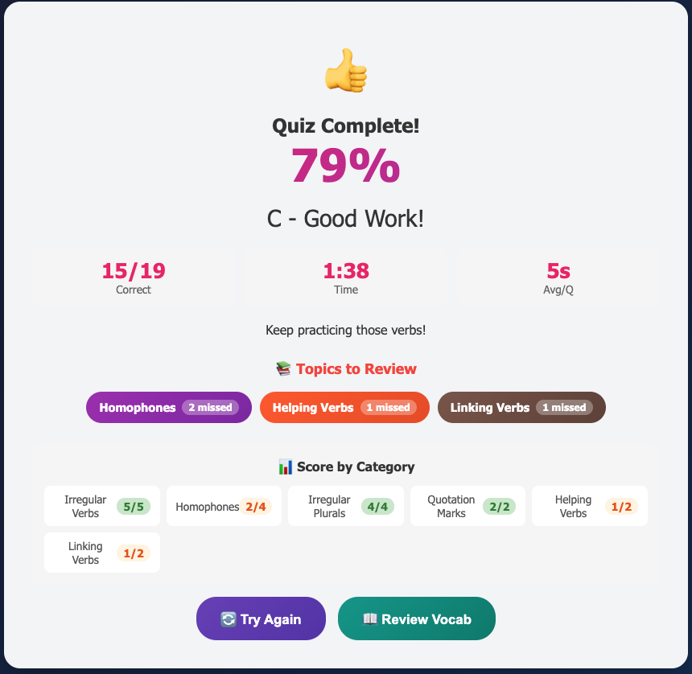
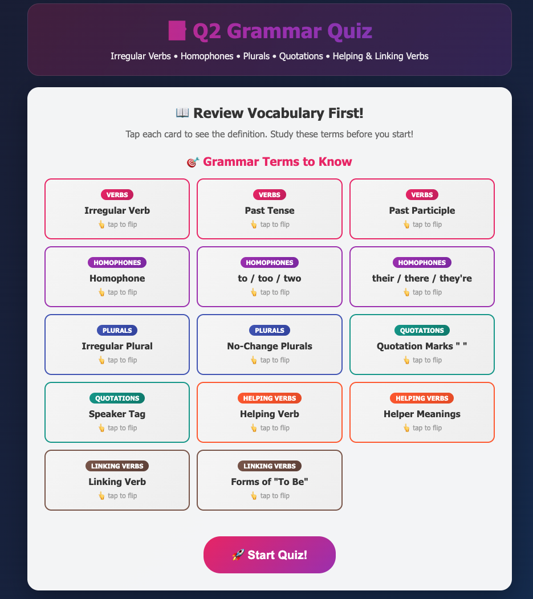
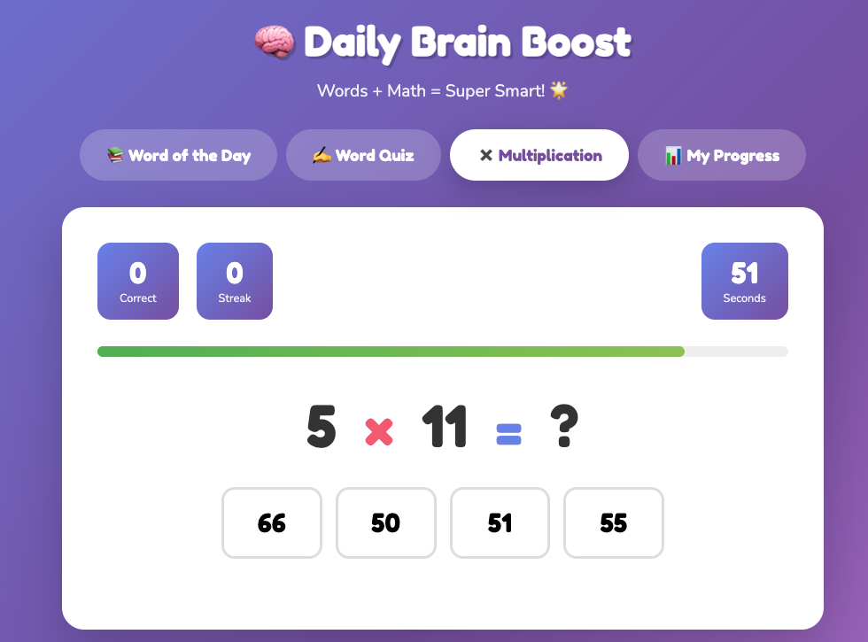

# 🎓 AI Study Quizzes

Interactive study quizzes I built using AI when my 4th grader had **5 exams in one week**!

---

## 📸 Screenshots

| Flashcards | Quiz Question | Results |
|------------|---------------|---------|
|  |  |  |

---

## 🎯 Live Demos

Try them now - no download needed!

### 📐 Math
- 🔢 [Fractions Quiz (Unit 4a)](https://dwonng.github.io/ai-study-quizzes/math/fractions_quiz.html) - Spanish immersion math
- 🔢 [Fractions & Decimals (Unit 4b)](https://dwonng.github.io/ai-study-quizzes/math/fractions_decimals_4b_quiz.html) - Ordering, comparing, converting
- 📐 [Unit Circle & Trig Quiz](https://dwonng.github.io/ai-study-quizzes/math/trig_unit_circle_quiz.html) - Quadrants, trig values, arc length, sector area

### 🔬 Science
- 💡 [Sound & Light Quiz](https://dwonng.github.io/ai-study-quizzes/science/science_sound_light_quiz.html) - Spanish immersion science
- 🌿 [Ecosystems Quiz](https://dwonng.github.io/ai-study-quizzes/science/ecosystems_quiz.html) - Producers, consumers, decomposers
- ⚡ [Force & Motion Quiz](https://dwonng.github.io/ai-study-quizzes/science/force_motion_quiz.html) - Newton's Laws, simple machines, friction

### 📚 Language Arts
- 📝 [Grammar Quiz](https://dwonng.github.io/ai-study-quizzes/language-arts/grammar_quiz.html) - Irregular verbs, homophones, plurals

### 🏛️ Social Studies
- 🏛️ [Social Studies Quiz](https://dwonng.github.io/ai-study-quizzes/social-studies/social_studies_quiz.html) - Bill of Rights, 3 Branches
- 🗺️ [Westward Expansion Quiz](https://dwonng.github.io/ai-study-quizzes/social-studies/westward_expansion_quiz.html) - Interactive map labeling, Louisiana Purchase, War of 1812

### 🎮 Games
- 🧠 [Daily Brain Boost](https://dwonng.github.io/ai-study-quizzes/games/daily_brain_boost.html) - Multiplication + Vocabulary
- 🏀 [Basketball Rebounding](https://dwonng.github.io/ai-study-quizzes/games/basketball_rebound_game.html) - Reaction training game

---

## ✨ Features

- ⏱️ **Timed questions** (like real tests)
- 🔀 **Shuffled questions & answers** (no memorizing!)
- 📊 **Results show which topics need review**
- 🇪🇸 **Spanish ↔ English hover translations**
- 📱 **Works on phone, tablet, or computer**
- 📝 **Vocabulary flashcards** before each quiz
- 🎯 **Instant feedback** with explanations

---

## 🛠️ Make Your Own!

Want to create quizzes for YOUR kid?

👉 **[Quiz Generator Prompt Template](./QUIZ_GENERATOR_PROMPT.md)**

Just copy the prompt, paste into ChatGPT/Claude/Cursor, add your study material!

---

## 📖 The Story

My child had exams on Wednesday, Thursday, AND Friday. Since tests are taken on computers now, I figured: why not practice on a computer too?

These quizzes helped them study faster and actually enjoy it!

---

## 🚀 How to Use

### Option 1: Use Live Links (Easiest)
Just click any quiz link above - they work instantly in your browser!

### Option 2: Download & Open Locally
1. **Download** the `.html` file you want (click file → Download)
2. **Open it** in any web browser:
   - **Double-click** the file, OR
   - **Right-click** → "Open with" → Chrome/Safari/Firefox/Edge
   - **Drag & drop** the file into an open browser window
3. The quiz runs entirely in your browser - no internet needed after download!

### Taking the Quiz
1. 📚 Review the vocabulary flashcards first
2. ▶️ Click "Start Quiz"
3. ⏱️ Answer questions before the timer runs out
4. 📊 Check your results and see which topics need review
5. 🔄 Try again to improve!

---

## 📄 License

Free to use! Share with other parents. 🎉

---

## 🙏 Contributing

Found a bug or have an idea? Open an issue or PR!

Made with ❤️ and AI

